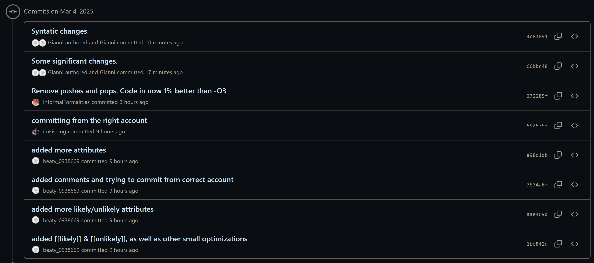
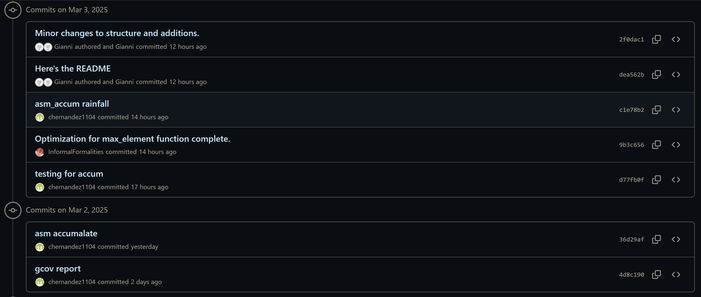
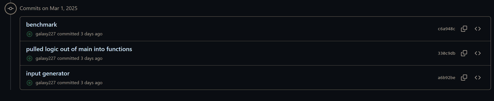

# GCOV: A REPORT ON OPTIMIZATION & TEST CASES 
*README curated by Gianni Joseph Bellucci* 

## -1) Declans Code: 
> **Note: this part includes `declan_rainfall.cc` and `asm_max_element`, which is my assembly version of max_element().** My idea for optimization was to write `max_element()` in ARM32. I did five runs with 10 million inputs fed into our program for both the unoptimized and optimized versions. The unoptimized (but still using -O3) time was **2.9568846 seconds**. The optimized (still using -O3) time was **2.916048 seconds**. This is approximately a 1% improvement, however the improvement is fairly significantly better the lower down the -Ox (g++ optimizer) route you go. This optimization was ultimately an improvement, even by a small margin. However, when considering simulations or games that must have tens of millions or even billions of operations a second, this is a significant improvement. Especially when taking into considerations other areas of optimization.

## -1.1) Celeste's Code: 
> My part includes `celeste_rainfall.cc` it has three changes in it, which is switching the c++ accumulate for my asm_accum, it is my assembly version of `accumulate()`. It is an optimized version of accumulate() in ARM32. I did ten runs on each with -O3, and the C++ version had a time of **3.1279461**, and the assembly had a time of **17.039352**. There is no improvement when the optimizer is on, if it is off, then there is an improvement. By removing the pushes and pops from asm_accum (no other changes)--and doing 5 runs of each--I got the time for the unoptimized -O3 run to be **2.9616198** seconds. The optimized (using asm_accum) with -O3 got **2.9615532** seconds. This is another 1% improvement over the g++ optimizer. Reason this is fine is you only use registers 0 - 3, meaning you don't need to push to the stack, thus a BX LR is sufficient. 

## -1.2) Gianni's Code: 
> For this, I manipulated the `main.cc` and `rainfall.cc` file for optimization purposes, which includes a while-loop that runs continuously to capture user input from the command line. Switch-cases were initially considered to replace the typical if-else conditional, as jump tables have faster compiler times, but this was discarded. Assembly was also considered for cin, but this stream buffer would be nearly impossible to emulate in ARM32. The changes were made to the logic of the while loop, becoming a simple while(true). Large arbitrary numbers hard-coded for test case purposes became `std::numeric_limits<int>::max()` numeric limits function. I got **2.9610952 seconds** for unoptimized -O3 and **2.8673276 seconds** for optimized -O3, leading to a 1% improvement using the new code. 

## -1.3) Corbin's Code: 
> My part includes `corben_rainfall.cc`. The unoptimized -O3 time was **4.745564** for a 1 million input test, and the optimized version came out to **4.637468**, which is a little more than a 2.25% decrease in time overall. The main techniques I used were the [[likely]] and  [[unlikely]] attributes, as well as accessing elements with `[]` instead of `.at()`. We are unable to use Constexpr and Consteval in this scenario due to all of the variables being added after compilation in the 'user' input.

